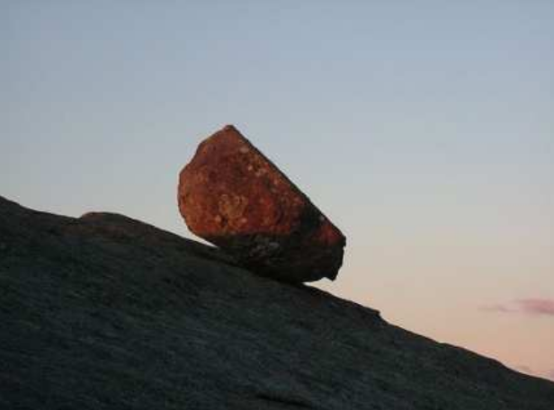

# Newpaper

```
De Juinense Kourant
Speciale Editie: Het Peddelfeest
Prijs: 1 Biertje
```
 
```
Waarde volgelingen,
Met veel devotie wijs ik u er wederom op
dat vanavond, Het Peddelfeest, haar
wortels heeft in de da g dat Heilige Harry
ten Hemel steeg. Het is mijn plicht deze
historie te wederhalen, opdat U deze
Heilige Dag juist weet te plaatsen.
Heilige Harry is ongeveer veertig jaar
geleden tot ons gekomen, in het jaar -37
VHH ('Voor Heilige Harry'). Precies 0 NHH
('Na Heilige Harry'), op Heilige Harry
Hemelvaartdag, steeg hij naar de Hemel.
Drie dagen lang vertoefde Zijn Gezegende
Lichaam op precies tien meter hoogte
boven precies het midden van ons
dorpsplein. Hij toonde ons drie dagen lang
hoe De Heilige Harry Dans uit te voeren. Na
deze uitputtingsslag viel hij neer op precies
het midden van ons dorpsplein. Deze dag
werd toen Heilige Harry Hemelval Dag
gedoopt.

Ik wijs u op uw plicht om Heilige Harry te
eren met het devoot uitvoeren van De
Heilige Harry Dans, opdat u het voorrecht
hebt geofferd te mogen worden. Doe u
kennen als aanbidder der Heilige Harry!

Uw herder, Eduard
```
 
```
Waarde wereldburgers,
Wederom is het uw voorrecht te mogen
stemmen op De Stemming, na De Heilige
Harry Dans, wie het beste Heilige Harry
vereert. Vooral wil ik u wijzen op het
zorvuldig invullen van Het Stembewijs:
vergeet u niet uw identiteitsbewijs, danwel
uw machtigingen

Uw burgemeester, Boris
```

```
Hieronimus' Horoscoop

Mannen: U zult vandaag zin hebben om
contact te zoeken met het andere geslacht.
Dit zal u goed afgaan.

Vrouwen: U zult vandaag zin hebben om
contact te zoeken met het andere geslacht.
Dit zal u goed afgaan.
```

``` 
Aangevraagde bouwvergunningen

Eppel: kernreactor
Isaac: brug #6734; tunnel #6735
Eduard: Heilige Harry Tempel, ter plaatse van cafe 'De Slinger'
```

```
Bezwaarschriften

Godelief: Heilige Harry Tempel, ter plaatse van cafe 'De Slinger'
Glycerientje: kernreactor
Eduard: brug #6734; tunnel #6735
```

```
Lezers Saluut,

Het is mij ter kennis gekomen dat er een plan op
poten is verondersteld dat er ten plaatse op de plek
van mijn cafe en kroeg een tempel geconcenteerd
zou moeten komen geworden gebouwen. Mijn
oprechtse overtuigsel vindt dit niet in coherent met
de zaken des voorkeurs des mijnes opinies.

Godelief
```

```
Medemensen,

Voel zelf, dit is niet natuurlijk: de natuur heeft geen
kernreactors. Dus is dit niet in overeenstemming. We
moeten de natuur respecteren.

Volg uw hart, Glycerientje
```

```
L.S.,

Om in de energievoorziening van het capitool Juine
te voorzien is het nodig andere energiebronnen aan
te snijden. Ik zeg altijd 'E = mc', dus! Eenieder die dit
niet inziet, is altijd welkom om mij om de waarheid
te vragen.
Overigens, laat u niet misleiden door pseudo-
wetenschappen zoals de astrologie! De Aarde draait
om de zon, de Aarde is rond, de zon komt op in het
oosten en de zon gaat onder in het westen! Ziet en
leert! Laat u niet misleiden door Hieronimus!

Isaac
```

```
Waarde volgelingen,

De Oversteek is pure ketterij. Het Heilige Harry
(Linker)Handboek leert ons hier vanaf te zien. Als u
mij niet steunt in deze overtuiging, gaat u naar de
Hel!

Uw herders, Eduard en Wibra
```

```
Beste lezers,
Soms kan uw herder afdwalen van het juiste pad. Ik
wist dan ook niks van bovenstaande brief.

Zegeningen, Wibra
```

```
Gezocht

Grijze steen, luistert naar de naam 'Herman'.

Compositietekening:```



```
Mocht u deze steen gezien hebben, neemt
u dan contact op met uw veldwachter.

Hoogachtend, Arnout
```

```
Kenau,
Helaas ben je dood,
Bij leven was je groot
Nu voel ik mij klot
e

Eppel
```

```
Het weer van vandaag

Het wordt vandaag bewolkt met hier en
daar een beetje zon; temperatuur 6 graden Celsius.
```
